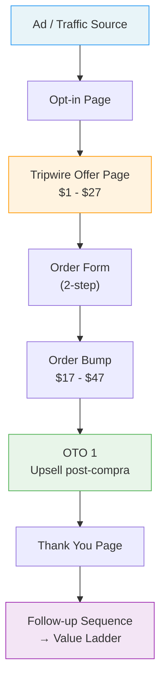

# Guia de Fichas de Blueprint

Este documento define el formato estandar para las fichas del catalogo de blueprints.

Cada blueprint del catalogo es un markdown que cumple dos funciones:

1. **Ficha de referencia** — documentacion completa del funnel type: que es, cuando usarlo, como funciona, de donde viene
2. **Fuente para visualizacion** — el diagrama mermaid embebido sirve como input para generar el canvas Excalidraw interactivo

---

## Estructura de una ficha

Cada archivo `bp-NN_short-name.md` tiene estas secciones obligatorias:

### Cabecera

- `# Blueprint: [Nombre]` — titulo
- Bloque de metadata: Type, Status (draft/validated), Confidence (stated/inferred/hypothesis), Created, Updated

### Secciones de contenido

| Seccion | Que contiene |
|---------|-------------|
| **Descripcion** | 2-4 frases: que es y que resultado produce. Sin teoria, mecanica concreta. |
| **Cuando usar** | 1-3 bullets con condiciones o escenarios donde aplica |
| **Componentes / Etapas** | Lista numerada: **Nombre** — funcion dentro del funnel |
| **Flujo visual** | Diagrama mermaid del recorrido del usuario. Fuente para el canvas Excalidraw. |
| **Mecanica clave** | 1-3 bullets: por que funciona, cual es el truco estructural |
| **Variantes conocidas** | Variantes documentadas o "Ninguna documentada aun." |
| **Blueprints relacionados** | Otros blueprints del catalogo o "Ninguno identificado aun." |
| **Fuentes** | Tabla con libro, bloque, confianza, notas |
| **Visual status** | Canvas: pendiente/draft/reviewed + nombre del archivo .excalidraw |

---

## Ejemplo completo: Two-Step Tripwire Funnel

Lo que sigue es un ejemplo real de como queda una ficha completa.

---

# Blueprint: Two-Step Tripwire Funnel

> Type: funnel-type
> Status: draft
> Confidence: stated
> Created: 2026-03-22
> Updated: 2026-03-22

## Descripcion

Funnel de dos pasos disenado para convertir trafico frio en compradores con una oferta
de precio muy bajo (tripwire). El objetivo no es el beneficio directo sino activar la
relacion de compra y abrir la puerta a upsells de mayor valor.

## Cuando usar

- Trafico frio que no conoce la marca
- Productos o servicios con un Value Ladder claro detras
- Cuando el objetivo es maximizar compradores, no revenue inmediato

## Componentes / Etapas

1. **Ad / Traffic source** — atrae al dream customer con un hook especifico
2. **Opt-in page** — captura email a cambio de un lead magnet relevante
3. **Tripwire offer page** — presenta la oferta de bajo precio (tipicamente $1-$27)
4. **Order form (2-step)** — captura datos de contacto primero, pago despues
5. **Order bump** — oferta complementaria en el checkout ($17-$47)
6. **OTO 1 (One-Time Offer)** — upsell inmediato post-compra
7. **Thank you page** — confirmacion + siguiente paso claro
8. **Follow-up sequence** — emails que ascienden al comprador por el Value Ladder

## Flujo visual



## Mecanica clave

- El tripwire rompe la barrera psicologica de la primera compra — una vez alguien paga $7, es mucho mas probable que compre a $97
- El order bump y OTO1 pueden autofinanciar (o incluso rentabilizar) el coste de adquisicion del lead
- El follow-up es donde esta el revenue real: ascender compradores por el Value Ladder

## Variantes conocidas

- Free + Shipping (el tripwire es "gratis" pero el usuario paga envio)
- $1 Trial (acceso temporal a un producto digital por $1)
- Webinar tripwire (el tripwire es un asiento en un webinar de pago bajo)

## Blueprints relacionados

- Self-Liquidating Offer Funnel (variante donde el frontend cubre costes de ads)
- Value Ladder Ascension Sequence (el sistema de follow-up que conecta con este funnel)

## Fuentes

| Libro | Bloque | Confianza | Notas |
|-------|--------|-----------|-------|
| DotCom Secrets | Bloque 04 | stated | Descrito como funnel frontend principal |

## Visual status

> Canvas: pendiente
> Archivo: bp-01_two-step-tripwire_canvas.excalidraw

---

## Pipeline de visualizacion

El flujo para pasar de ficha a canvas interactivo:

```text
1. Se crea la ficha markdown con el mermaid embebido
2. El usuario dice "visualiza este blueprint" o "hazme el canvas del bp-01"
3. El visual-editor lee la ficha, toma el mermaid como input estructural
4. Genera el canvas Excalidraw con layout espacial optimizado para recall
5. Se actualiza el Visual status de la ficha (pendiente → draft → reviewed)
```

El mermaid no es decoracion: es la **fuente estructural** que el visual-editor usa para construir el canvas.
El canvas no es una copia bonita del mermaid: es una **reorganizacion espacial** pensada para explorar y jugar con las etapas.

---

## Reglas del mermaid

- Usar `graph TD` (top-down) para funnels lineales
- Usar `graph LR` (left-right) para flujos con ramas paralelas
- Maximo 12 nodos por diagrama — si el funnel es mas complejo, dividir en sub-diagramas
- Cada nodo debe corresponder 1:1 a un componente de "Componentes / Etapas"
- Usar `style` para colorear nodos clave (entry point, conversion point, revenue point, retention)
- Labels cortos y descriptivos — el detalle esta en la lista de componentes

---

## Limites del formato

- Maximo 80 lineas por ficha (sin contar el bloque mermaid)
- User-facing content en espanol; nombres de funnel types y frameworks en ingles original
- Un solo mermaid por ficha (el principal, no variantes)
- Las variantes se documentan en texto, no en mermaid adicionales
