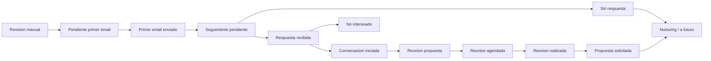

# Funnel Map v1 — IA Mujeres

- Date: 2026-06-07
- Model: funnel comercial en espanol con traduccion operativa al CRM actual

## Principio de diseno

El funnel se disena para conversacion institucional, no para automatizacion agresiva. El lenguaje comercial del equipo puede ser mas claro en espanol que el `outreachStatus` actual, pero ambos deben convivir.

## Mermaid

## Traduccion al CRM actual

| Estado comercial | `outreachStatus` actual | Notas |
|---|---|---|
| Pendiente primer email | `pending_first_email` | Estado base de salida. |
| Primer email enviado | `first_email_sent` | Primer envio confirmado. |
| Seguimiento pendiente | `follow_up_pending` | Ventana de seguimiento abierta. |
| Respuesta recibida | `replied` | Reply detectado o registrado. |
| Reunion propuesta | `meeting_to_schedule` | Hay interes y se propone agenda. |
| Reunion agendada | `meeting_scheduled` | Fecha o acuerdo de reunion. |
| No interesado | `lost` | Cierre negativo. |
| Nurturing / a futuro | `nurturing` | No encaja ahora, pero merece seguimiento futuro. |

Los estados `Revision manual`, `Conversacion iniciada`, `Reunion realizada`, `Propuesta solicitada` y `Sin respuesta` hoy se representan con una combinacion de task, nota, `meetingStatus`, `meetingDate` y juicio humano.

## Tabla de estados

| Estado | Que significa | Evento activador | Owner principal | Tarea generada | Siguiente paso recomendado | Criterio de salida |
|---|---|---|---|---|---|---|
| Revision manual | Registro no apto aun para contacto. | `needs_manual_review=true` o inconsistencia relevante. | Humano + CRM | Revisar contacto, area, duplicados. | Limpiar o descartar. | Se resuelve o se archiva. |
| Pendiente primer email | Opportunity valida y lista para primer contacto. | Deal importado y aprobado para lote. | CRM + Humano | Preparar draft o cola de salida. | Crear draft revisado. | Draft aprobado o registro vuelve a review. |
| Primer email enviado | Primer correo ya salio. | `email_sent` registrado por GWS o actualizacion manual. | GWS + CRM | Crear tarea de seguimiento. | Esperar reply o preparar seguimiento. | Pasa a seguimiento pendiente. |
| Seguimiento pendiente | Ya hubo primer envio y se abre ventana de espera. | Cambio a `follow_up_pending` o tarea creada. | CRM + Humano | Revisar plazo y decidir seguimiento. | Monitorizar respuesta. | Hay reply, se cierra como sin respuesta, o se pasa a nurturing. |
| Respuesta recibida | Llego una respuesta util o relevante. | `reply_received` o registro manual. | GWS + CRM + Humano | Leer, clasificar y responder. | Determinar si hay conversacion real. | Se confirma interes, objecion o cierre. |
| Conversacion iniciada | Ya no es solo un reply; hay intercambio con sustancia. | Humano marca que existe conversacion real. | Humano + CRM | Preparar respuesta o propuesta de reunion. | Llevar a reunion. | Hay propuesta de reunion o se enfria. |
| Reunion propuesta | Se ha propuesto agenda concreta. | Humano responde con invitacion a reunion. | Humano + CRM | Follow-up de agenda. | Cerrar fecha. | Se agenda o se mueve a nurturing. |
| Reunion agendada | Existe fecha acordada o confirmacion operativa. | Confirmacion de agenda. | CRM + Humano | Preparar reunion. | Celebrar reunion. | Reunion realizada o cancelada. |
| Reunion realizada | La conversacion sincronica ya ocurrio. | Humano registra reunion celebrada. | Humano + CRM | Nota de reunion y siguiente accion. | Valorar propuesta o nurturing. | Se pide propuesta o se cierra siguiente paso. |
| Propuesta solicitada | La entidad pide propuesta o siguiente documento formal. | Solicitud explicita tras reunion. | Humano + CRM | Preparar propuesta a medida. | Elaborar propuesta. | Propuesta enviada o oportunidad en pausa. |
| Sin respuesta | No hubo respuesta tras la ventana definida. | Vence seguimiento sin respuesta cualificada. | CRM + Humano | Decidir cierre o nurturing. | No insistir agresivamente. | Se cierra o se mueve a nurturing. |
| No interesado | La entidad indica que no sigue. | Reply negativo o cierre humano. | Humano + CRM | Registrar motivo. | Cerrar limpio. | Fin del flujo. |
| Nurturing / a futuro | No hay accion inmediata, pero el contacto no se quema. | Sin timing, sin respuesta util o interes futuro. | CRM + Humano | Nota de proximo ciclo. | Reapertura futura. | Se reabre o se archiva. |

## Ownership por sistema

### CRM / Twenty

Fuente de verdad para:

- deal y company asociados;
- prioridad;
- `campaignName`;
- `businessLineName`;
- estado comercial operativo;
- tareas;
- notas;
- reuniones.

### GWS CLI

Fuente operativa para:

- draft creado;
- email enviado;
- `message_id`;
- `thread_id`;
- reply recibido;
- bounce si es detectable.

### Humano

Obligatorio para:

- sacar un registro de review;
- aprobar el draft;
- interpretar replies;
- decidir si hay conversacion real;
- proponer o agendar reunion;
- cerrar como no interesado o nurturing.

## Reglas de avance

- Ningun registro con `needs_manual_review=true` sale a primer email.
- Un `generic_email` de area si puede avanzar si el area es correcta.
- `reply_received` no equivale automaticamente a oportunidad cualificada.
- `Sin respuesta` no debe detonar seguimiento agresivo en esta fase.
- `Propuesta solicitada` solo aparece tras conversacion real, no por intuicion comercial.
